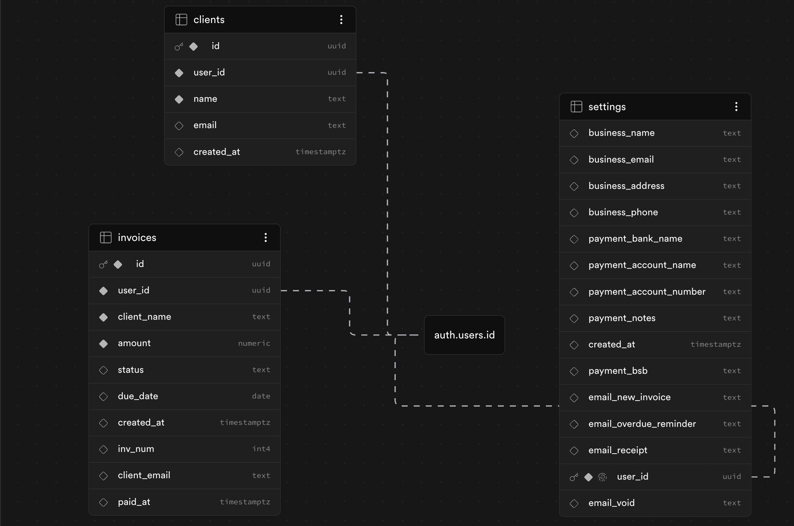

> "I was tired of paying for QuickBooks subscriptions, so I built a tool tailored to my own workflow."

# Remit | Simple Invoicing for Freelancers

Remit is a lightweight, responsive invoicing dashboard built for freelancers who want full control over their billing without the overhead of enterprise tools. It features a clean UI, real-time database sync, and secure per-user data isolation. I currently use it to run my own freelance business. No more subscriptions 😊

---

## 🚀 Key Features

- **User Authentication** – Secure sign-up and login via Supabase Auth with middleware-level session protection
- **Full CRUD Support** – Create, read, update, and delete invoices with immediate UI feedback
- **Financial Insights** – Real-time calculation of Total Outstanding, Total Collected, Average Invoice Amount, and 7-Day Rolling Average
- **Dynamic Status Management** – Categorize invoices as Draft, Unpaid, Paid, Overdue, or Void via a custom action menu
- **Client Management** – Maintain a client list and associate invoices to clients
- **Printable Invoices** – Dedicated invoice view optimized for print
- **Dark / Light Mode** – Theme toggle
- **Secure Data Architecture** – Row-Level Security (RLS) policies enforce strict data isolation between users

---

## 🛠️ Tech Stack

| Layer              | Technology                                  |
| ------------------ | ------------------------------------------- |
| Framework          | Next.js 16 (App Router, Server Actions)     |
| Language           | TypeScript                                  |
| UI                 | React 19, shadcn/ui, Radix UI, Lucide React |
| Styling            | Tailwind CSS v4                             |
| Forms & Validation | React Hook Form + Zod                       |
| Auth & Database    | Supabase (PostgreSQL + RLS)                 |
| Deployment         | Vercel                                      |

---

## 🗄️ Database Schema

The app uses three user-scoped tables, all isolated via RLS policies tied to `auth.users`.

- **invoices** — core billing records, including status lifecycle and `paid_at` timestamp for audit trail
- **clients** — reusable client profiles associated to invoices
- **settings** — per-user business and payment details used to populate printable invoices

## 🤕 Challenges Overcome

**Authentication & Middleware Architecture**
The toughest part of this project wasn't writing features — it was understanding how authentication _flows_ through a Next.js App Router application. Getting Supabase Auth to work correctly across server components, server actions, and middleware required a complete mental model shift away from the traditional client-side auth patterns I was used to. Once it clicked, everything else became much more composable.

**Void-Over-Delete: A Business Logic Decision**
Early on, I implemented hard invoice deletion. I later realised this was the wrong call — deleting financial records creates gaps in your audit trail, which is a real problem at tax time. I refactored to a void status instead, preserving the full history of every invoice while clearly marking cancelled ones. It was a small schema change with a large real-world implication, and it pushed me to think about the _business correctness_ of the app, not just its technical correctness.

**Nested Dialogs & Form Submission**
Adding a seemingly simple feature — a form inside a modal, triggered from within another modal — cascaded into two days of debugging. Radix UI's dialog components have specific behaviour around focus trapping and portal rendering that doesn't play well with nested compositions out of the box. Solving it required understanding the underlying DOM and event propagation at a level I hadn't previously needed to. A useful reminder that UI complexity compounds quickly.

**Dropdown Menus in Overflow-Hidden Containers**
Custom action menus inside a clipped table layout caused dropdowns to render behind or get cut off by parent containers. Resolving this required understanding CSS stacking contexts and `z-index` layering — the kind of invisible problem that's obvious in hindsight but opaque until you've been burned by it.

---

## 💡 Lessons Learned

**Full-stack thinking is a different discipline.**
Building Remit end-to-end forced me to make decisions I'd previously left to someone else — how to structure the database, where to validate data, which logic belongs on the server vs. the client. I came away with a much stronger sense of how the layers of a full-stack app interact, and why those boundaries matter for security, performance, and maintainability.

**TypeScript pays off under pressure.**
There were moments where TypeScript felt like friction — especially when wiring up Supabase-generated types with form schemas and server action responses. But every time I refactored something or changed a data shape, the type errors caught real mistakes before they hit the UI. The upfront cost is real; so is the return.

**Security is a design concern, not a feature.**
Configuring Row-Level Security in Supabase wasn't just about checking a box — it meant thinking about _who should be able to do what, and why_, at the schema level. Treating data access as a first-class architectural concern, rather than an afterthought, changed how I approach backend design generally.

---

## 📌 Status

Remit is a working MVP currently in active personal use. Core invoicing workflows are stable. Planned improvements include automated overdue detection, email notifications, and expanded reporting.
